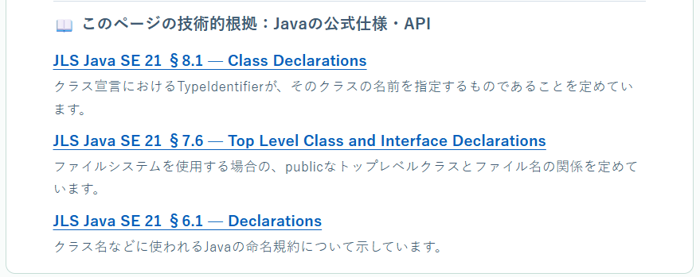
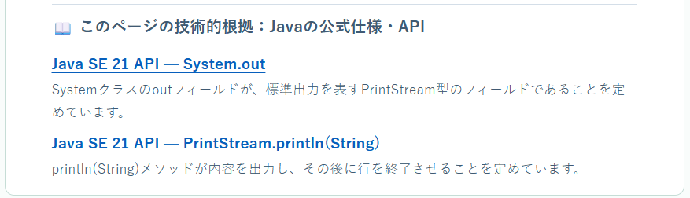
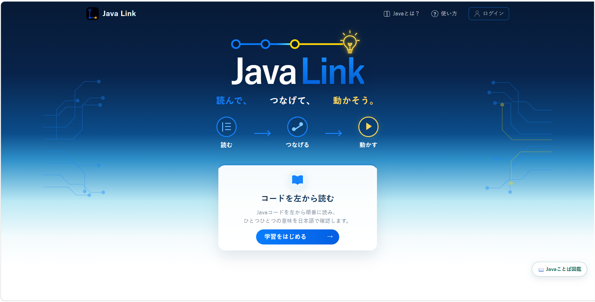
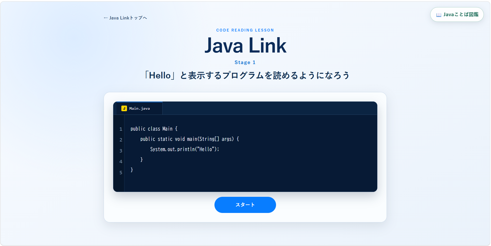
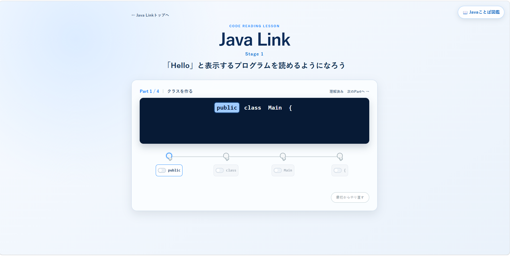
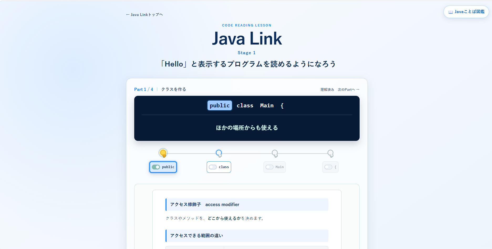
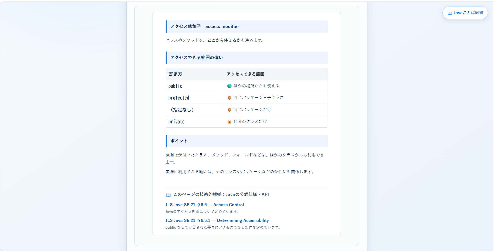
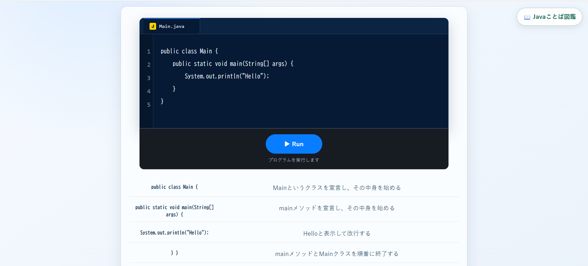
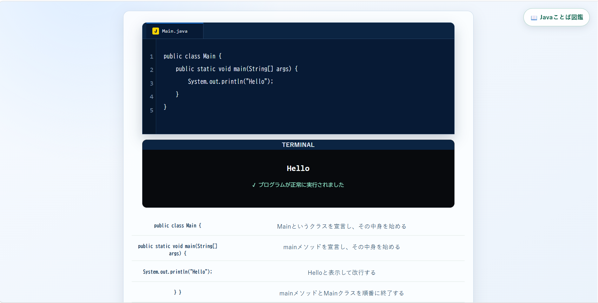

# Java Link

> **初心者の今しか生まれない「わからない」を教材に。**
>
> **― 学びながら開発する、開発しながら学ぶ ―**

  

Java Link は、Java初心者向けの学習Webアプリです。

開発者自身がJavaを学び始めたときに感じた「わからない」を、初心者の今だからこそ持てる大切な視点だと考え、教材設計に取り入れています。

Java Linkは、開発者自身が初心者である「今」だからこそ作れる教材を目指しています。

---

# 教材設計

## ① 説明は変わらない

Java Linkでは、「今はここだけ覚えれば大丈夫」といった学習段階に応じた説明ではなく、最初から最後まで同じ説明を使います。

**説明は変わりません。**

**変わるのは、学習者の理解です。**

学習を進めるほど、同じ説明から読み取れる内容が増え、見える景色が変わっていきます。

---

## ② 用語は何度でも確認できる

一度出てきた用語を覚えた前提で学習を進めることはしません。

思い出したいときに、いつでも、すぐに、何度でも確認できる教材を目指しています。

何度も忘れ、コードの中で出てくるたびに思い出すことを繰り返すことで、用語同士がつながり、点だった知識が線になっていくと考えています。

---

## ③ 用語の説明にはJavaの公式資料のみ参照する

初心者にわかりやすいことだけでなく、説明の正確性も大切にしています。

用語の説明では、Javaの公式ドキュメントに限定して参照しています。

NotebookLMのソースにはJava Language Specification（JLS）およびJava APIドキュメントのみを使用し、**公式資料で根拠を確認できた内容のみを記載しています。**

サイト上では、各用語に根拠となる公式ドキュメントへのリンクを記載しています。

### 公式資料との対応例

**Java Language Specification（JLS）**

  

**Java SE API**

  

---

# Java Linkの画面

  

---

# 学習モード

## コードを左から読む

Javaコードを左から順番に読み進めながら、それぞれの部分の意味や役割を理解し、そのつながりからJava全体の仕組みを学ぶ学習モードです。

### 学習の流れ

#### ① 最初にコード全体を見る

学習を始める前に、これから読むプログラム全体を確認します。

  

#### ② コードを左からひとつずつ読み進める

問題に答える形式ではなく、コードの下に並ぶボタンを押しながら、public や class などの意味や役割を順番に確認していきます。

  

ボタンを押すと、その部分の意味が表示されて💡が点灯し、用語についての説明も表示されます。

  

用語の説明では、関連する知識に加えて、説明の根拠となるJava公式ドキュメントまで確認できます。

  

#### ③ 読み終えたコード全体を確認する

すべての部分を読み終えると、完成したプログラム全体と、それぞれの意味をまとめて確認できます。

  

#### ④ プログラムを実行して結果を確認する

最後に「Run」ボタンを押してプログラムを実行し、読んできたコードが実際にどのような結果になるのかを確認します。

  

### Java Linkでできるようになること

- 初めて見るコードでも、左からひとつずつ意味を追いながら読み進められる
- コードの一部分だけでなく、全体の流れを捉えられる
- 繰り返し登場するコードに触れることで、その意味や役割を自然に身につけられる
- すべての部分に説明があることで、「わからないところが出るたびに学習を中断して調べる」という負担を減らしながら学習を進められる

---

# 現在の実装状況

## コードを左から読む

- ✅ Stage 1「Hello」と表示するプログラムを読めるようになろう
- ✅ Stage 2 変数を使って年齢を表示しよう
- ✅ Stage 3 変数を使った計算を読もう

## DB・ログイン・学習進捗保存

現在、利用者ごとの学習進捗を保存・再開できるようにするため、DB・ログイン機能の導入に向けた実装を進めています。

- 🔄 PostgreSQL / Spring Data JPA を使用したデータ永続化

- 🔄 Spring Securityを使用したログイン機能

- 🔄 利用者ごとの学習進捗の保存・再開

---

# アプリケーション構成

Java Linkは、Spring Bootを使用したWebアプリケーションです。

Javaコードは役割ごとに `controller`、`service`、`model` に分けています。

- **Controller**：ブラウザからのリクエストを受け取り、Serviceの処理や画面表示につなぐ
- **Service**：学習進行、回答処理、進捗管理など、役割ごとに処理を分担する
- **Model**：教材、学習ステップ、進捗、画面表示などで使用するデータを表現する
- **Templates**：Thymeleafを使用して画面を表示する
- **Static**：CSS、JavaScript、画像などの静的ファイルを配置する

「コードを左から読む」では、Controllerが受け取った操作をServiceへ渡し、
学習進行を管理するServiceから、進捗管理・回答処理・画面状態などを担当するクラスへ処理を分担する構成としています。

---

# 開発で実装した内容

Java Linkでは、学習の進行や画面表示を実現するために、次の機能や仕組みを実装しています。

* **Spring BootによるWebアプリケーション構築**
  ブラウザからアクセスして学習を進められるWebアプリとして構築しています。

* **Controller / Service / Modelによる処理の分担**
  ブラウザからの入力、学習処理、進捗管理、教材データなどを役割ごとに分けて実装しています。

* **Thymeleafによる画面表示**
  Java側で管理している教材や学習状態をHTMLへ渡し、学習画面に反映しています。

* **HTTPセッションを利用した学習進捗管理**
  現在のStep、完了したStep、回答状態などをセッションに保存し、学習途中の状態を管理しています。

* **JavaScriptによる学習画面の動的な更新**
  回答結果に応じた電球の点灯、説明・進捗表示の更新、次のStepの有効化に加え、まとめ画面ではコンパイルから実行結果表示までの流れを視覚的に表現しています。

* **Mavenによるビルド・テスト**
  Mavenを利用してアプリケーションの実行やテストを行っています。

* **Git / GitHubによるバージョン管理**
  変更内容をGitで記録し、GitHubでソースコードを管理しています。

* **ブランチとPull Requestを利用した開発**
  mainブランチを直接編集せず、作業ごとにブランチを作成し、Pull Requestで差分を確認してからmainへ反映しています。

---

# 使用技術

- Java
- Spring Boot
- Thymeleaf
- HTML
- CSS
- JavaScript
- Maven
- Git
- GitHub

---

# AIツールの活用

- **ChatGPT**：設計の検討、コード理解、教材内容の整理に活用
- **Codex**：実装・コードレビュー・テストなどの開発支援に活用
- **NotebookLM**：Java Language Specification（JLS）およびJava APIドキュメントをソースとして、教材説明の根拠確認に活用

Codexで作成・変更したファイルは、差分とテスト結果を確認したうえで反映しています。

実装されたコードは、意味のまとまりごとに区切り、Java文法、処理の内容、アプリ内での役割を確認しながら学習記録を残しています。

教材内容については、AIの回答そのものを根拠にはせず、NotebookLMのソースをJava Language Specification（JLS）とJava APIドキュメントに限定し、公式資料で根拠を確認できた内容を教材に採用しています。

---

# 開発環境

- VS Code
- JDK

---

# 今後の展開

- ログイン機能の追加
- 学習進捗の保存・再開機能の追加
- コードを組み立てながら理解する学習機能への発展
- 学習Stage・教材内容の充実
- UI / UX の改善
- テストの充実
- README・設計資料の整備

---

