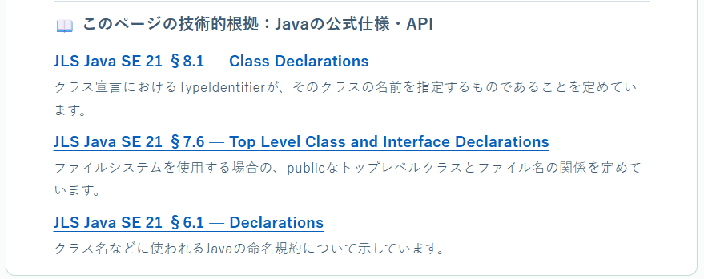
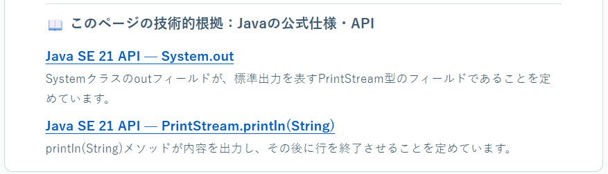
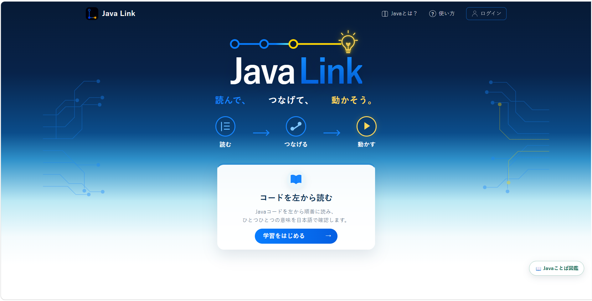
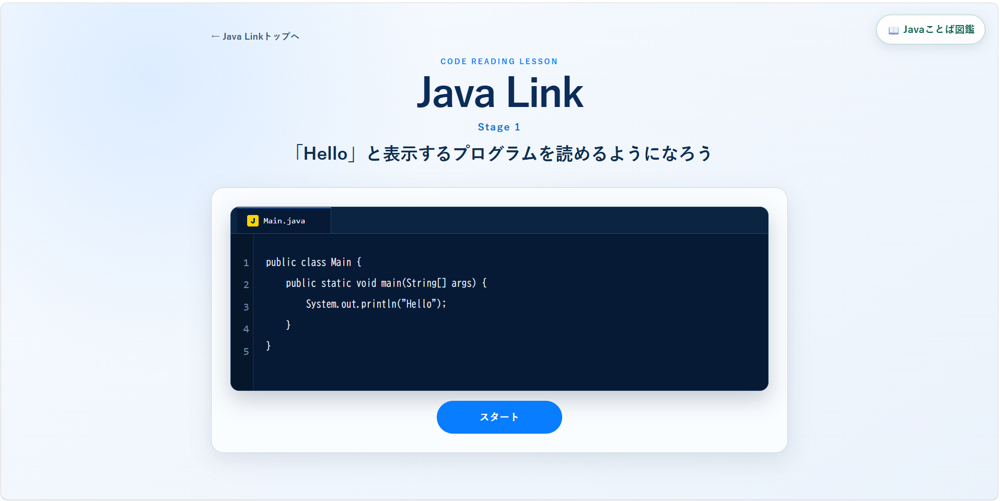
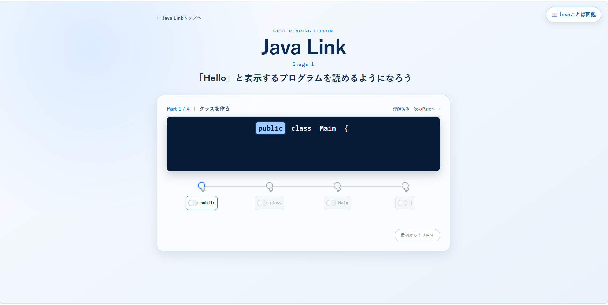
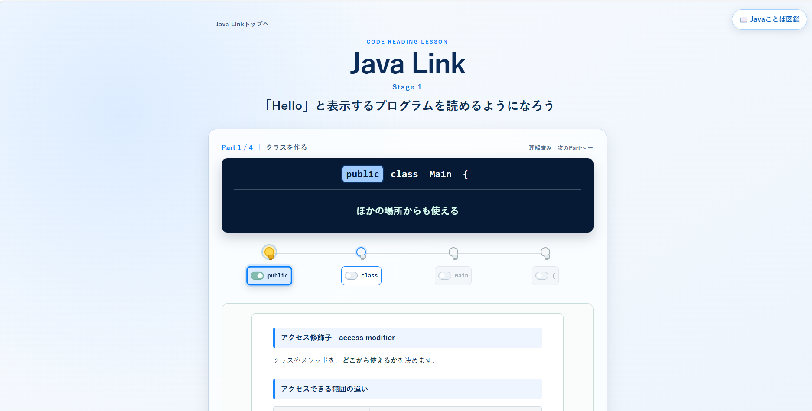
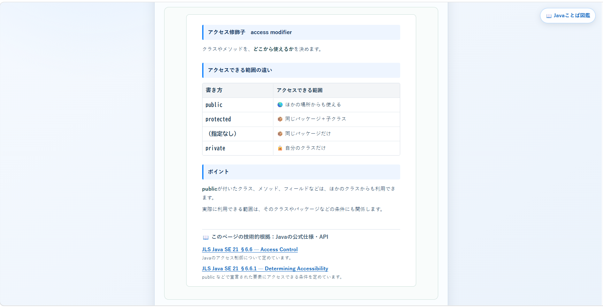
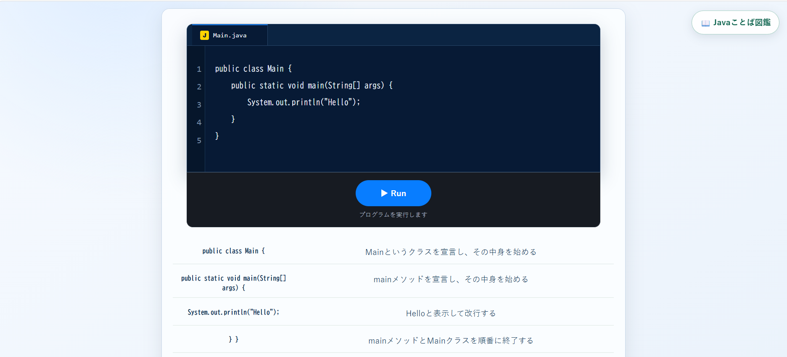
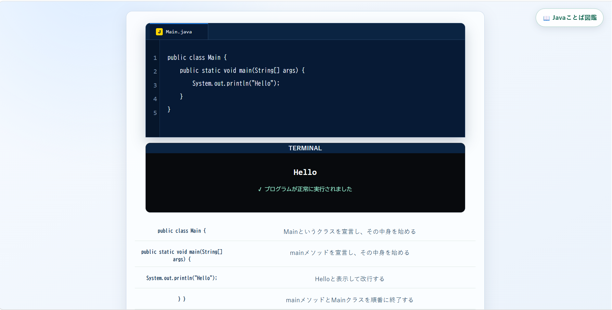
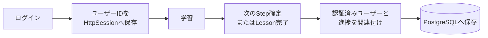

# Java Link

> **初心者の今しか生まれない「わからない」を教材に。**
>
> **― 学びながら開発する、開発しながら学ぶ ―**

  

Java Linkは、Javaを学び始めて2週間目に開発を始めたWebアプリです。

自身が学習する中で感じた課題を解決するために、学習と並行して開発を始めました。

初心者の今だからこそ感じる「わからない」を大切な視点と捉え、その感覚が薄れてしまう前に教材設計に取り入れ、**教材を作る過程を通して自身の学習課題も解決していきます。**

Java Linkは、開発者自身が初心者である「今」だからこそ作れる教材を目指しています。

---

# 教材設計

## ① 説明は変わらない

Java Linkでは、「今はここだけ覚えれば大丈夫」といった学習段階に応じた説明ではなく、最初から最後まで同じ説明を使います。

**説明は変わりません。**

**変わるのは、学習者の理解です。**

学習を進めるほど、同じ説明から読み取れる内容が増え、見える景色が変わっていきます。

---

## ② 用語は何度でも確認できる

一度出てきた用語を覚えた前提で学習を進めることはしません。

思い出したいときに、いつでも、すぐに、何度でも確認できる教材を目指しています。

何度も忘れ、コードの中で出てくるたびに思い出すことを繰り返すことで、用語同士がつながり、点だった知識が線になっていくと考えています。

---

## ③ 用語の説明にはJavaの公式資料のみ参照する

初心者にわかりやすいことだけでなく、説明の正確性も大切にしています。

用語の説明では、Javaの公式ドキュメントに限定して参照しています。

NotebookLMのソースにはJava Language Specification（JLS）およびJava APIドキュメントのみを使用し、**公式資料で根拠を確認できた内容のみを記載しています。**

サイト上では、各用語に根拠となる公式ドキュメントへのリンクを記載しています。

### 公式資料との対応例

**Java Language Specification（JLS）**

  

**Java SE API**

  

---

# Java Linkの画面

  

---

# 学習モード

## コードを左から読む

Javaコードを左から順番に読み進めながら、それぞれの部分の意味や役割を理解し、そのつながりからJava全体の仕組みを学ぶ学習モードです。

### 学習の流れ

#### ① 最初にコード全体を見る

学習を始める前に、これから読むプログラム全体を確認します。

  

#### ② コードを左からひとつずつ読み進める

問題に答える形式ではなく、コードの下に並ぶボタンを押しながら、public や class などの意味や役割を順番に確認していきます。

  

ボタンを押すと、その部分の意味が表示されて💡が点灯し、用語についての説明も表示されます。

  

用語の説明では、関連する知識に加えて、説明の根拠となるJava公式ドキュメントまで確認できます。

  

#### ③ 読み終えたコード全体を確認する

すべての部分を読み終えると、完成したプログラム全体と、それぞれの意味をまとめて確認できます。

  

#### ④ プログラムを実行して結果を確認する

最後に「Run」ボタンを押してプログラムを実行し、読んできたコードが実際にどのような結果になるのかを確認します。

  

### Java Linkでできるようになること

- 初めて見るコードでも、左からひとつずつ意味を追いながら読み進められる
- コードの一部分だけでなく、全体の流れを捉えられる
- 繰り返し登場するコードに触れることで、その意味や役割を自然に身につけられる
- すべての部分に説明があることで、「わからないところが出るたびに学習を中断して調べる」という負担を減らしながら学習を進められる

---

# 現在の実装状況

## コードを左から読む

- ✅ Stage 1「Hello」と表示するプログラムを読めるようになろう
- ✅ Stage 2 変数を使って年齢を表示しよう
- ✅ Stage 3 変数を使った計算を読もう

## DB・ログイン・学習進捗保存

ユーザー登録からログイン、学習進捗のPostgreSQLへの保存までを実装しています。

- ✅ PostgreSQL / Spring Data JPAによるユーザー情報・学習進捗の永続化

- ✅ メールアドレスとパスワードによるユーザー登録・ログイン

- ✅ BCryptによるパスワードのハッシュ化と、メールアドレスの重複防止

- ✅ ログイン成功時にユーザーIDだけをHttpSessionへ保存し、必要なときにユーザー情報を取得

- ✅ ログイン済みユーザーが次のStepへ進んだとき、またはLessonを完了したときの進捗保存

- ✅ 未ログインの場合は、従来どおりHttpSessionだけで学習可能

- 🔄 DBに保存した進捗の復元と「続きから再開」

### ログインから学習進捗保存まで

```mermaid
flowchart LR
    Login[ログイン]
    Session[ユーザーIDを<br/>HttpSessionへ保存]
    Learning[学習]
    Progress[次のStep確定<br/>またはLesson完了]
    Link[認証済みユーザーと<br/>進捗を関連付け]
    DB[(PostgreSQLへ保存)]

    Login --> Session
    Session --> Learning
    Learning --> Progress
    Progress --> Link
    Link --> DB
```

現在は進捗の保存まで実装済みです。DBからの進捗復元、続きから再開するUI、完了した個々のStepや回答状態のDB保存、ログアウト、アクセス制御、Spring Securityによる正式な認証状態管理は未実装です。

---

# アプリケーション構成

Java Linkは、Spring Bootを使用したWebアプリケーションです。

Javaコードは役割ごとに `controller`、`service`、`model`、`entity`、`repository`、`config` に分けています。

- **Controller**：ブラウザからのリクエストを受け取り、Serviceの処理や画面表示につなぐ
- **Service**：学習進行、回答処理、進捗管理など、役割ごとに処理を分担する
- **Model**：教材、学習ステップ、進捗、画面表示などで使用するデータを表現する
- **Entity**：ユーザー情報と永続化する学習進捗を表現する
- **Repository**：Spring Data JPAを利用してPostgreSQLへの保存・取得を行う
- **Config**：パスワードのハッシュ化など、アプリケーションで共通して使用する設定を管理する
- **Templates**：Thymeleafを使用して画面を表示する
- **Static**：CSS、JavaScript、画像などの静的ファイルを配置する

「コードを左から読む」では、Controllerが受け取った操作をServiceへ渡し、
学習進行を管理するServiceから、進捗管理・回答処理・画面状態などを担当するクラスへ処理を分担する構成としています。

---

# 開発で実装した内容

Java Linkでは、学習の進行や画面表示を実現するために、次の機能や仕組みを実装しています。

* **Spring BootによるWebアプリケーション構築**
  ブラウザからアクセスして学習を進められるWebアプリとして構築しています。

* **Controller / Service / Modelによる処理の分担**
  ブラウザからの入力、学習処理、進捗管理、教材データなどを役割ごとに分けて実装しています。

* **Thymeleafによる画面表示**
  Java側で管理している教材や学習状態をHTMLへ渡し、学習画面に反映しています。

* **HTTPセッションを利用した学習進捗管理**
  現在のStep、完了したStep、回答状態などをセッションに保存し、学習途中の状態を管理しています。

* **Spring Data JPAによるデータ永続化**
  PostgreSQLへユーザー情報とLesson単位の学習進捗を保存しています。メールアドレスはDBのUNIQUE制約でも重複を防ぎ、ユーザーとLessonの組み合わせごとに1件の進捗を管理しています。

* **ユーザー登録・ログイン処理**
  パスワードは `spring-security-crypto` のBCryptでハッシュ化して保存し、ログイン時はメールアドレスとパスワードを照合します。ログイン成功後はUserAccountのIDだけをHttpSessionに保持します。

* **学習フローとDB進捗保存の連携**
  ログイン済みユーザーが次のStepへ進んだときは更新後のStep IDを、Lessonを完了したときは最終Step IDと完了状態をDBへ保存します。未ログインユーザーはHttpSessionだけで学習を続けられます。

* **JavaScriptによる学習画面の動的な更新**
  回答結果に応じた電球の点灯、説明・進捗表示の更新、次のStepの有効化に加え、まとめ画面ではコンパイルから実行結果表示までの流れを視覚的に表現しています。

* **Mavenによるビルド・テスト**
  Mavenを利用してアプリケーションの実行やテストを行っています。

* **Git / GitHubによるバージョン管理**
  変更内容をGitで記録し、GitHubでソースコードを管理しています。

* **ブランチとPull Requestを利用した開発**
  mainブランチを直接編集せず、作業ごとにブランチを作成し、Pull Requestで差分を確認してからmainへ反映しています。

---

# 使用技術

- Java
- Spring Boot
- Thymeleaf
- HTML
- CSS
- JavaScript
- PostgreSQL
- Spring Data JPA
- Hibernate
- H2（テスト）
- BCrypt（spring-security-crypto）
- Maven
- Git
- GitHub

---

# AIツールの活用

- **ChatGPT**：設計の検討、コード理解、教材内容の整理に活用
- **Codex**：実装・コードレビュー・テストなどの開発支援に活用
- **NotebookLM**：Java Language Specification（JLS）およびJava APIドキュメントをソースとして、教材説明の根拠確認に活用

Codexで作成・変更したファイルは、差分とテスト結果を確認したうえで反映しています。

実装されたコードは、意味のまとまりごとに区切り、Java文法、処理の内容、アプリ内での役割を確認しながら学習記録を残しています。

教材内容については、AIの回答そのものを根拠にはせず、NotebookLMのソースをJava Language Specification（JLS）とJava APIドキュメントに限定し、公式資料で根拠を確認できた内容を教材に採用しています。

---

# 開発環境

- VS Code
- JDK

---

# 今後の展開

- DBに保存した学習進捗の復元
- 前回のStepから「続きから再開」する機能
- 「最初から／続きから」を選択するUI
- ログアウト・アクセス制御の追加
- Spring Securityによる正式な認証状態管理への移行
- コードを組み立てながら理解する学習機能への発展
- 学習Stage・教材内容の充実
- UI / UX の改善
- テストの充実
- README・設計資料の整備

---

