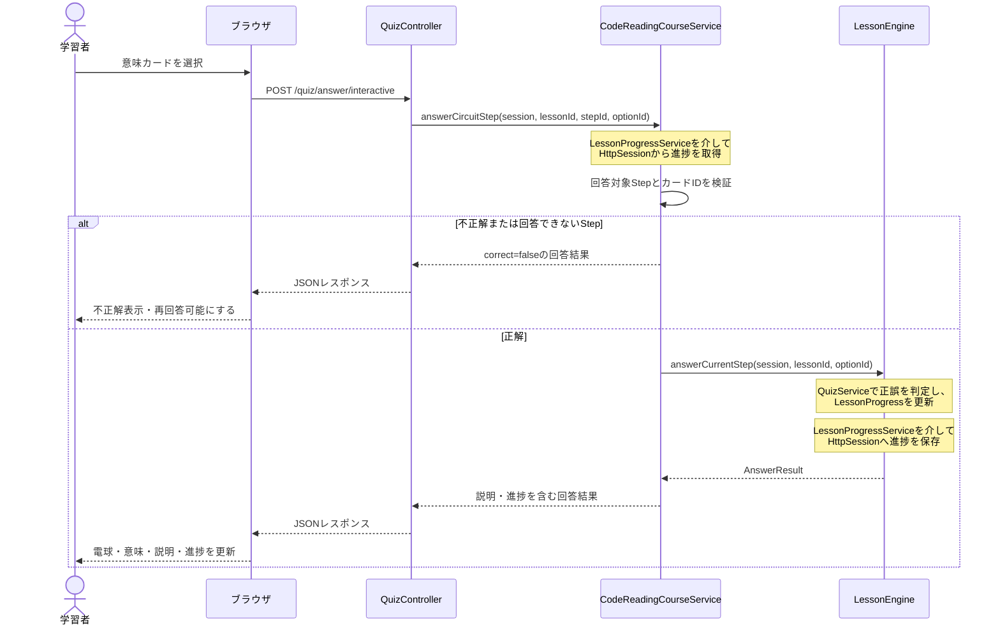

# Java Link 概要設計書

## 1. 文書概要

### 1.1 目的

本書は、Java Linkの現行実装におけるシステム構成、画面、教材構造、主要処理および状態管理の概要を示す。GitHub上で実装の全体像を確認できる資料とし、個々のクラスやテストケースの詳細仕様は対象外とする。

### 1.2 対象範囲

対象は、Javaのコードを左から順番に読み、コード要素と意味を対応付けて学習する「コードを左から読む」機能である。現行実装に存在する次の範囲を扱う。

- トップ画面
- Stage 1〜3のコードリーディング教材
- INTRO、LEARNING、SUMMARYの各画面フェーズ
- 回答、Step・Part遷移、進捗管理、リセット
- 教材完了後の疑似Run
- 教材説明とJava公式資料の表示

### 1.3 前提・制約

- 本書はソースコードを正とし、過去の構想や削除済みのJavaタウン機能を現行仕様に含めない。
- 学習進捗と画面フェーズはHTTPセッションで管理し、データベースには永続化しない。
- RunはJavaコードをコンパイル・実行せず、教材カタログに定義された固定結果を返す疑似実行である。
- 対応ブラウザ、運用環境、SLA、監視およびバックアップの正式要件は、現行実装から確認できない。

## 2. システム概要

### 2.1 アプリケーションの目的

Java Linkは、Java初学者が完成コードを意味のまとまりに分け、各コード要素を左から順番に読めるようになることを目的とするWebアプリケーションである。

利用者はコード要素に対応する意味カードを選択し、正解後に初心者向け説明、比較表、具体例およびJava公式資料を確認する。学習の進行に合わせてコード回路上のStepが完了状態になり、すべてのPartを終えると完成コードを振り返って疑似Runできる。

### 2.2 対象利用者

Javaの基本構文を学び始めた初学者を対象とする。現行教材は、クラス宣言、`main`メソッド、変数、標準出力および算術演算子などの基礎要素を扱う。

### 2.3 提供機能

- Stage単位のコードリーディング学習
- 完成コードと学習目標の事前確認
- Part・Step単位の段階的な学習
- 意味カードによる正誤判定
- 正解後の構造化された教材説明表示
- JLSおよびJava SE APIへの公式資料リンク表示
- 学習進捗と画面フェーズのセッション管理
- Part単位の理解済み操作
- Stage単位および全Stageのリセット
- 完成コードの振り返りと固定結果による疑似Run

### 2.4 現行機能の対象外

現行機能には次を含まない。

- Javaタウン
- 利用者登録、ログインおよび権限管理
- 学習進捗のデータベース永続化
- 任意のJavaコード入力、コンパイルおよび実行
- 教材を画面から登録・編集する管理機能

## 3. システム構成

### 3.1 全体構成

Java Linkは、Spring MVCを使用したサーバーサイドWebアプリケーションである。

```text
ブラウザ
  ├─ Thymeleafで生成されたHTML
  ├─ CSS
  └─ JavaScript（回答直後の表示更新、SUMMARYの演出）
        │
        ▼
Controller
  ├─ HomeController
  └─ QuizController
        │
        ▼
Service
  ├─ 学習フロー・正誤判定・進捗管理
  ├─ 教材・Part・表示データの取得
  └─ 疑似Run
        │
        ▼
Model / 教材カタログ / HTTPセッション
```

ControllerはHTTP入力と画面遷移を担当し、正誤判定や進捗更新をServiceへ委譲する。教材データは`CodeReadingLessonCatalog`に定義され、変化する学習状態はHTTPセッションに保持する。

### 3.2 使用技術

| 分類 | 技術 |
|---|---|
| 言語 | Java 17 |
| Webフレームワーク | Spring Boot 3.5.4、Spring MVC |
| テンプレート | Thymeleaf |
| フロントエンド | HTML、CSS、Vanilla JavaScript |
| セッション | Jakarta Servlet `HttpSession` |
| JSON | Jackson（Spring Boot標準構成） |
| ビルド | Maven |
| 自動テスト | JUnit 5、Spring Test、MockMvc、Mockito |
| アプリケーションポート | 8085 |

### 3.3 ディレクトリ構成

```text
java-link/
├─ pom.xml
├─ src/
│  ├─ main/
│  │  ├─ java/com/javalink/
│  │  │  ├─ controller/   HTTP入力と画面遷移
│  │  │  ├─ service/      教材、学習、進捗、表示組み立て
│  │  │  ├─ model/        教材定義、状態、画面表示データ
│  │  │  └─ JavaLinkApplication.java
│  │  └─ resources/
│  │     ├─ templates/    Thymeleafテンプレート
│  │     ├─ static/       CSS、JavaScript、画像
│  │     └─ application.properties
│  └─ test/java/com/javalink/
│     ├─ controller/
│     └─ service/
└─ docs/
```

## 4. 画面設計概要

### 4.1 画面一覧

| 画面 | テンプレート | 概要 |
|---|---|---|
| トップ画面 | `home.html` | アプリの概要とコードリーディングへの導線を表示する |
| コードリーディング画面 | `quiz.html` | INTRO、LEARNING、SUMMARYを同一テンプレート内で切り替える |

`java-glossary.html`はThymeleafフラグメントであり、独立したURLを持つ画面ではない。

### 4.2 URL一覧

| HTTP | URL | 役割 |
|---|---|---|
| GET | `/` | トップ画面を表示する |
| GET | `/quiz` | デフォルトのStage 1を表示する |
| GET | `/quiz?lessonId={lessonId}` | 指定Stageを表示する |
| POST | `/quiz/start` | Stageの学習を開始する |
| POST | `/quiz/answer` | 現在Stepへ通常回答する |
| POST | `/quiz/answer/interactive` | JavaScript用の回答結果をJSONで返す |
| POST | `/quiz/answer/circuit` | JavaScriptなしで回路上のStepへ回答する |
| POST | `/quiz/item/next` | 同じPart内の次Stepへ進む |
| POST | `/quiz/part/understood` | 現在Partを理解済みとして完了する |
| POST | `/quiz/part/next` | 次PartまたはSUMMARYへ進む |
| POST | `/quiz/run` | 完了済み教材を疑似Runする |
| POST | `/quiz/reset` | 現在Stageの進捗とフェーズをリセットする |
| POST | `/quiz/reset-all` | 全StageをリセットしてStage 1へ戻る |

### 4.3 画面遷移

```text
トップ画面
  └─ /quiz
       ▼
     INTRO
       │ 学習開始
       ▼
     LEARNING
       │ Stepを回答・確認
       │ Part内を順番に進行
       │ Part完了後に次Partへ
       ▼
     SUMMARY
       ├─ Run
       ├─ このStageをもう一度
       ├─ 次のStageへ（次Stageが存在する場合）
       └─ Stage 1からやり直す（Stage 2以降）
```

### 4.4 INTRO・LEARNING・SUMMARY

| フェーズ | 主な表示・操作 |
|---|---|
| INTRO | Stage名、学習目標、完成コード、学習開始ボタン |
| LEARNING | Part情報、コード、回路、意味カード、正解後のExplanation、Part遷移 |
| SUMMARY | 完成コード、Partごとの振り返り、Run、TERMINAL、Stageナビゲーション |

画面フェーズは`CodeReadingPhase`で表し、`CodeReadingFlowState`として教材ごとにセッションへ保存する。

## 5. 教材構造

### 5.1 Stage・Part・Step

教材は次の階層で構成する。

```text
Stage
└─ Part
   └─ Step
```

- **Stage**: 1つの完成コードと学習目標を持つ教材単位。
- **Part**: 完成コードを意味のあるコードのまとまりに分けた単位。
- **Step**: Part内のコードを左から読む際の最小学習単位。対象コード、正解カード、説明Sectionなどを持つ。

各Partは対象コード、Stepの順序、表示用トークン、導入文、完了時の補足および振り返り文を保持する。各Stepは教材内で一意なIDを持ち、コード回路とコード表示行から同じIDで参照される。

### 5.2 Stage一覧

| Stage | lesson ID | テーマ | Part数 | Step数 | 疑似Run出力 |
|---|---|---|---:|---:|---|
| Stage 1 | `hello-program-reading` | 「Hello」と表示するプログラム | 4 | 16 | `Hello` |
| Stage 2 | `variable-program-reading` | 変数を使って年齢を表示 | 5 | 21 | `20` |
| Stage 3 | `operator-program-reading` | 演算子を使って計算 | 7 | 33 | `30` |

Stage 1はクラス、`main`メソッド、標準出力を扱う。Stage 2は変数の宣言と利用を追加し、Stage 3は複数の変数と算術演算子`+`を扱う。

### 5.3 教材データの管理方式

教材データの正本は`CodeReadingLessonCatalog`である。Javaコード内で次を定義する。

- Stage ID、Stage名、学習目標
- 完成コードと疑似Run出力
- Stepと意味カード
- Explanation
- Part構成
- コード回路
- コード表示行

`CodeReadingLessonDefinition`は生成時にIDの一意性や、StepとPart・回路・コード表示行の対応関係を検証する。データベース、JSONまたはYAMLから教材を読み込む仕組みは実装されていない。

### 5.4 共通Explanation

Stepの説明は`CodeReadingExplanationSection`のリストとして表現する。Sectionは本文、表、図、例、Q&A、比較、リスト、公式資料などの種別を持つ。

Stage間で再登場する同じJava要素は、同一内容を複製せず共通Explanationを参照する。対象には`public`、`class`、`Main`、`{`、`static`、`void`、`main`、`String[]`、`args`、`int`、代入、整数リテラル、`;`、`System.out.println`、変数の利用、`}`などがある。

これにより、同じ概念が別Stageへ登場した場合も説明内容、Section順、表および公式資料を同一に保つ。

### 5.5 Java公式資料

教材説明の根拠は`CodeReadingOfficialReference`として構造化する。

- 資料種別: JLSまたはJava SE API
- Javaバージョン
- 資料名
- Section番号・タイトル
- 根拠説明
- URL

URLはHTTPSかつ`docs.oracle.com`であることをModel生成時に検証する。画面上の外部リンクには`target="_blank"`と`rel="noopener noreferrer"`を設定する。リンク先の到達性を実行時に確認する機能は持たない。

## 6. アプリケーション構成

### 6.1 Controller

| Controller | 責務 |
|---|---|
| `HomeController` | トップ画面を表示する |
| `QuizController` | コードリーディングのHTTP入力、Service呼び出し、画面Model構築、遷移およびJSON応答を制御する |

Controllerは正誤判定や進捗更新を直接実装せず、Serviceへ委譲する。

### 6.2 Service

Serviceは概要上、次の役割に分類する。

| 分類 | 主な責務 |
|---|---|
| 教材管理 | Stage・Part・Step・Explanationの定義と取得 |
| 学習制御 | 正誤判定、Step移動、Part完了、SUMMARY遷移 |
| 状態管理 | 教材別の進捗と画面フェーズをセッションへ保存 |
| 表示組み立て | 教材定義と進捗からViewModel、コード回路、選択肢を生成 |
| Run | 必須Stepの完了確認と固定結果の返却 |

`CodeReadingCourseService`がコードリーディングのユースケースをまとめ、`LessonEngine`、進捗、Part、フェーズなどのServiceを組み合わせる。

### 6.3 Model

Modelは次の4種類に分類する。

| 分類 | 例 | 役割 |
|---|---|---|
| 教材定義 | `CodeReadingLessonDefinition`、`CodeReadingPart`、`CodeReadingStepDefinition` | Stage・Part・Stepの不変な教材データ |
| 説明 | `CodeReadingExplanationSection`、`CodeReadingOfficialReference` | 教材説明と根拠資料 |
| 学習状態 | `LessonProgress`、`CodeReadingFlowState` | セッション内で変化する進捗とフェーズ |
| 画面・応答 | `CodeReadingPageViewModel`、`CodeReadingAnswerResponse`、`ProgramRunResult` | TemplateまたはJavaScriptへ渡すデータ |

### 6.4 View・JavaScript

`home.html`はトップ画面を表示する。`quiz.html`はフェーズに応じてINTRO、LEARNING、SUMMARYを切り替える。

LEARNINGでは、Thymeleafによる再読み込み後のサーバー描画と、`quiz-reading.js`による回答直後のクライアント描画の両方を使用する。どちらも同じ構造化Explanationを入力とし、Section種別に応じて本文、表、図、Q&A、公式資料などを描画する。

`quiz-summary-run.js`はSUMMARY上でRun結果を段階的に表示する演出を担当する。

## 7. 主要処理フロー

### 7.1 学習開始

1. 利用者がINTROで学習開始を選択する。
2. `QuizController`が`CodeReadingCourseService`を呼び出す。
3. 対象Stageの`LessonProgress`を初期化する。
4. 画面フェーズをLEARNINGへ変更する。
5. `/quiz`へリダイレクトし、Part 1の先頭Stepを表示する。

### 7.2 回答・正誤判定

1. 利用者が意味カードを選択する。
2. Controllerがlesson ID、対象Step ID、選択肢IDを受け取る。
3. Course Serviceが現在のPartと回答可能なStepを確認する。
4. `LessonEngine`が`QuizService`を利用して正誤を判定する。
5. 回答結果を`LessonProgress`へ保存する。
6. 正解時はStepを完了済みにし、教材全体の完了状態を更新する。
7. 回答直後は現在Stepに留まり、Explanationを表示する。

JavaScript経路では`CodeReadingAnswerResponse`をJSONで返し、電球、説明、ボタン状態を画面上で更新する。通常フォーム経路ではPOST後に`/quiz`へリダイレクトする。

#### 回答処理シーケンス



### 7.3 次Step・次Partへの遷移

正解内容を確認した後、利用者が次の問題へ進む。現在Stepが回答済み・正解・完了済みであり、同じPart内に未完了の次Stepがある場合のみ移動する。

Part内の全Stepが完了するとStep移動を止め、Part完了表示へ切り替える。利用者が次Partへの操作を行った場合、最終Partでなければ次Partの先頭Stepへ移動し、最終PartであればSUMMARYへ切り替える。

### 7.4 Part理解済み処理

利用者が現在Partを理解済みと判断した場合、既存の正解処理を使ってPart内の未完了Stepを順番に完了させる。その後、通常のPart遷移処理を利用して次PartまたはSUMMARYへ進む。

### 7.5 Stage完了

最終Partの全Step完了後、次Partへの操作により画面フェーズをSUMMARYへ変更する。SUMMARYでは完成コード、Partごとの振り返り、RunおよびStageナビゲーションを表示する。

次Stageが存在する場合のみ次Stageへのリンクを表示する。Stage 3では次Stageリンクを表示しない。

### 7.6 Run

1. SUMMARYでRunを選択する。
2. `LessonRunService`が対象教材の必須Stepを取得する。
3. 全必須Stepが完了しているか検証する。
4. 完了済みなら教材カタログの固定出力を返し、Run済み状態を保存する。
5. 画面上のTERMINALへ結果を表示する。

### 7.7 リセット

- **このStageをもう一度**: 対象教材の進捗とフェーズのみ初期化する。
- **Stage 1からやり直す**: カタログに登録された全教材をリセットし、Stage 1のINTROへ戻る。

## 8. 状態管理

### 8.1 セッション管理方針

変化する状態は`HttpSession`に教材ID別のMapとして保持する。教材定義自体はセッションへ保存せず、アプリケーション内のカタログから取得する。

### 8.2 学習進捗

セッション属性`LESSON_PROGRESS_MAP`は、教材IDをキーとして`LessonProgress`を保持する。

`LessonProgress`の主な状態は次のとおりである。

- lesson ID
- 現在Step ID
- 完了済みStep ID集合
- 選択したOption ID
- 回答済みか
- 正解か
- 教材完了か
- Run済みか

### 8.3 画面フェーズ

セッション属性`CODE_READING_FLOW_MAP`は、教材IDをキーとして`CodeReadingFlowState`を保持する。フェーズはINTRO、LEARNING、SUMMARYのいずれかである。

進捗とフェーズを別の状態として管理することで、同じ進捗データに対して導入・学習・まとめの表示を切り替える。

### 8.4 Stage間の進捗分離

進捗MapとフェーズMapはいずれもlesson IDをキーにするため、同一セッション内でもStageごとの状態を分離する。

Stage単独リセットは他Stageの状態を維持する。全Stageリセットはカタログに登録されたすべてのlesson IDについて進捗とフェーズを初期化する。

## 9. Run機能

### 9.1 実行条件

対象教材に必須Stepが存在し、そのすべてが完了済みであることを実行条件とする。条件を満たさない場合は失敗結果を返し、Run済み状態へ変更しない。

### 9.2 疑似実行方式

Runは実際のJavaコンパイル・実行ではない。外部プロセスやJavaコンパイラを起動せず、`CodeReadingLessonCatalog`に教材ごとに登録された`consoleOutput`を返す。

この方式により、学習用の完成コードと期待結果の対応を安全かつ固定的に表示する。

### 9.3 実行結果表示

実行成功時は`ProgramRunResult`に成功状態、教材ID、固定のコンソール出力およびメッセージを設定する。SUMMARY画面ではRun結果をTERMINAL形式で表示し、セッションのRun済み状態によりコンソール表示を制御する。

## 10. テスト概要

### 10.1 自動テスト構成

現行の`src/test`には15テストクラス、139テストが存在する。テストは主に次の分類で構成する。

| 分類 | 主な対象 |
|---|---|
| Controllerテスト | HTTPステータス、View、リダイレクト、画面要素、セッションを伴う操作 |
| Serviceテスト | 正誤判定、進捗、Step・Part遷移、フェーズ、Run |
| 教材データテスト | Stage構造、説明、表、公式資料、共通Explanation |
| Modelテスト | Section種別、公式資料URLの制約 |
| 静的リソーステスト | JavaScript、Thymeleaf、CSSの描画契約 |

### 10.2 主な検証範囲

- Stage 1〜3のPart・Step構成とRun出力
- 学習開始、正解、不正解、Step・Part・Stage遷移
- Step飛ばしおよび不正な入力の拒否
- ページ再読み込み後の進捗復元
- 教材別のセッション分離とリセット
- ExplanationのSection順、表、文言、公式資料
- 同じJava概念のExplanation共有
- JavaScript描画とThymeleaf描画に必要な構造
- 公式資料URLのHTTPS・Oracleドメイン制約

### 10.3 自動テスト対象外

現行テストから、次の自動検証は確認できない。

- 実ブラウザによるE2E操作
- PC幅・モバイル幅での実レイアウト
- 計算済みCSS、文字重なり、横スクロール
- JavaScriptを実ブラウザで実行したDOM結果
- Oracle公式資料リンクの到達性
- 負荷、性能、同時実行
- 対応ブラウザ間の差異
- Javaコードの実コンパイル・実行

## 11. 制約事項

- 学習状態はHTTPセッション内にのみ保持され、データベースには永続化されない。
- セッション終了後の進捗保持は保証しない。
- 教材はJavaコード内に定義され、管理画面から追加・編集できない。
- Runは固定結果を返す疑似実行であり、任意のJavaコードを評価しない。
- Java公式資料リンクの形式は検証するが、リンク先の可用性は検証しない。
- 認証、認可、利用者別アカウント管理は実装されていない。
- 対応ブラウザ、デプロイ構成、監視、バックアップ、可用性および性能の正式要件は、現行実装から確認できない。
- 詳細な画面寸法、CSS仕様、全Model項目、全メソッド仕様および全テストケースは、本概要設計書の対象外とする。
